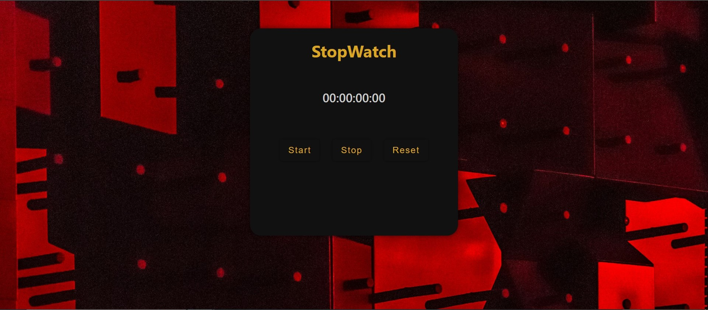

# Stopwatch

A simple and functional stopwatch implemented using HTML, CSS, and JavaScript. The stopwatch displays time in the format `hh:mm:ss::ms` and supports start, stop, and reset functionalities.

## Live Demo
The site is hosted live on Netlify. You can view it here: [Stopwatch](https://stopwatch-by-saqib.netlify.app/)

## Features
- **Start**: Begin the stopwatch.
- **Stop**: Pause the stopwatch.
- **Reset**: Reset the stopwatch to zero.

## Installation
To run the project locally:
1. Clone the repository: git clone https://github.com/Saqibb786/StopWatch.git

## Contributions
If you’d like to contribute, feel free to fork the repository and submit a pull request. You can also open an issue for any bugs or feature requests.

## License
This project is licensed under the MIT License - see the [LICENSE](LICENSE) file for details.
